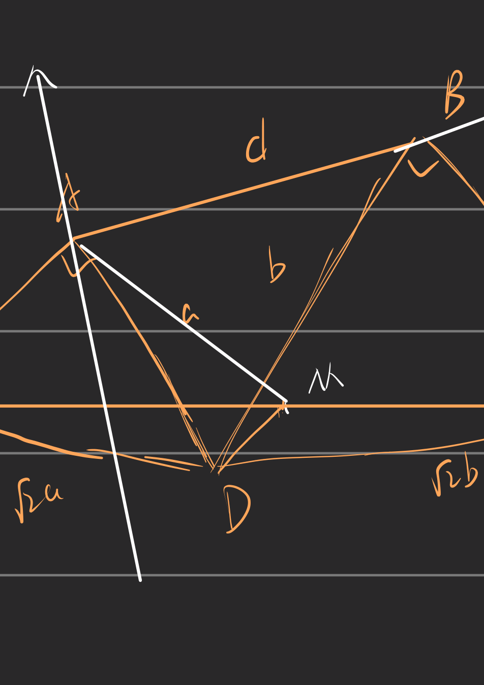
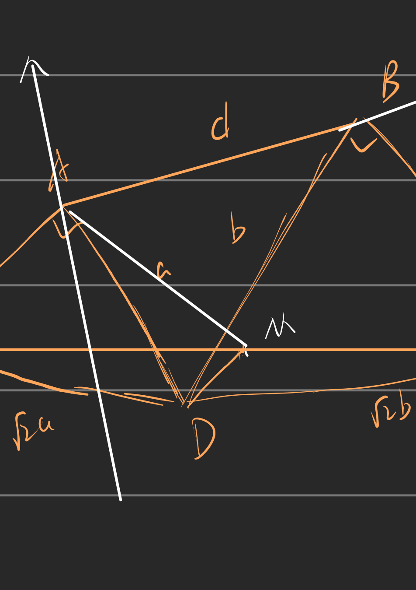
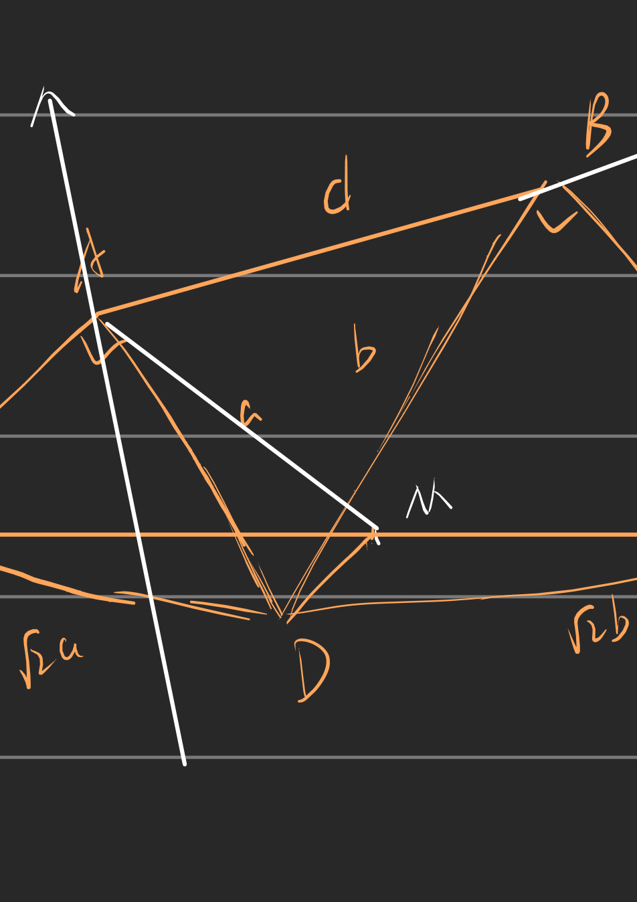
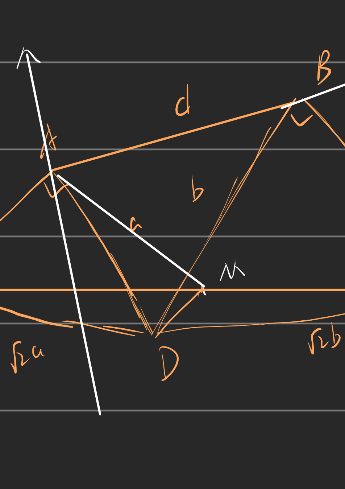
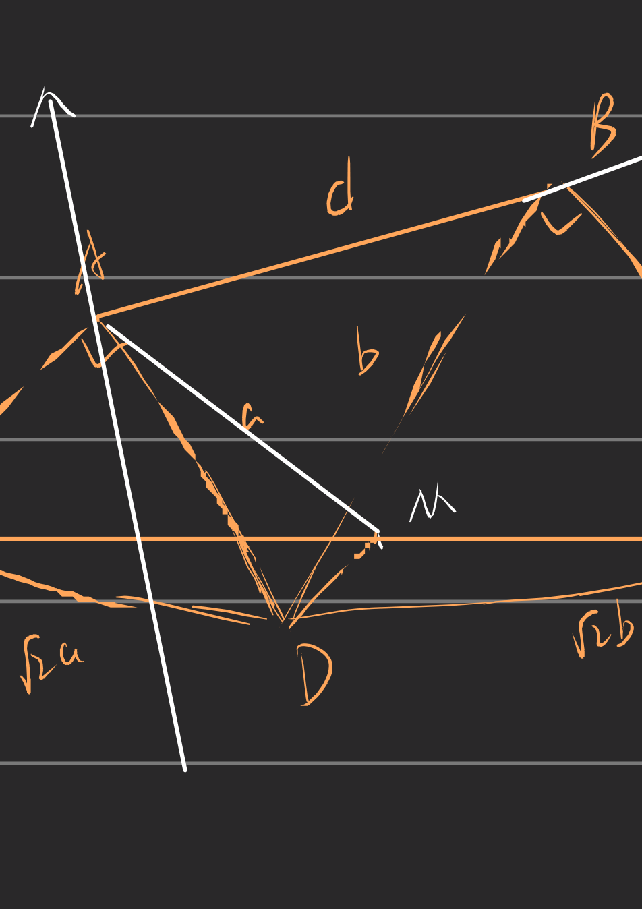

# Fireworks PDF Compressor ML

中文 | [English](#english)

面向 GitHub 仓库托管场景的 PDF 优化工具，目标是在保持可读性的前提下，将大体积 PDF 尽可能压缩到 **100MB 以下**。

---

## 中文

### 项目目标

- 服务于 GitHub 仓库中的 PDF 分发场景（100MB 限制）。
- 在压缩率与可读性之间提供工程化平衡。
- 支持可选 ML 图像增强链路与 Windows EXE 发布。

### 处理流水线

- **阶段一（无损优先）**
  1. 结构清理（对象与元数据层面）
  2. Ghostscript 重排（含文本异常检测与多层回退：流级对比+页级对比，自动注入缺失资源引用）
  3. 安全图片压缩（低风险重编码，支持 CMYK 图片正确处理）
- **阶段二（有损交错）**
  - 每级固定顺序：`矢量 -> 图片 -> 切片`
  - 强度阶梯：`L1(50dB) -> L2(45dB+曲线简化) -> L3a(激进矢量) -> L3b(形状变换+40dB) -> L4(35dB)`
  - 文件仍超目标时逐步增强；低于 100MB 则提前退出
- **压缩后端**：所有 FlateDecode 压缩点使用 libdeflate Level 12（替代 zlib L9），通过 ctypes 释放 GIL 实现多线程并发

### 矢量压缩

矢量压缩由 Cython nogil 引擎（C 级热循环逐字节处理）驱动，作用于 PDF 绘图指令流（路径命令与坐标数字），提供三种互补的压缩手段：

- **精度自适应截断**：根据页面尺寸自动选择最优有效数字位数。
- **Bézier 曲线→直线简化**：通过叉积距离识别接近直线的曲线段并简化。双阈值（绝对 + 相对）保护小圆弧（如字符笔画），同时简化大弧度笔画。
- **圆形→菱形形状变换 + 共线段合并**：将 4-Bézier 圆形替换为视觉等效的 4 线菱形，并合并共线线段。

强度从低到高分为五个层级：
  - **L1（保守）**：轻度精度截断（sf4），视觉变化几乎不可察觉。
  - **L2（均衡 + 曲线简化）**：中度精度截断（sf3）+ Bézier 曲线→直线简化，大多数课件/笔记中体积收益明显。
  - **L3a（激进矢量）**：激进矢量压缩（sf3），作为独立阶段提供额外矢量体积收益。
  - **L3b（形状变换）**：圆形→菱形形状变换 + 共线段合并，是单步体积收益最大的阶段（某测试文件单步 41.0%）。
  - **L4（最强）**：最强精度截断（sf2），仅在文件仍超目标时触发。
- 实际执行时，这些强度在有损阶段中逐步推进，低于 100MB 阈值即提前退出。

### 压缩效果示例

以一份 **141 页板写笔记**（185.63 MB）为测试样本，第 6 页局部对比（10%~30% 区域，8× 渲染）：

|                原始 (185.63 MB)                |            无损 (157.57 MB, 15.1%)             |         L1 (149.81 MB, 19.3%)          |         L2 (132.41 MB, 28.7%)          |
| :--------------------------------------------: | :--------------------------------------------: | :------------------------------------: | :------------------------------------: |
|  |  |  |  |

|                原始 (185.63 MB)                |          L3a (110.23 MB, 40.6%)          |          L3b (64.96 MB, 65.0%)           |          L4 (49.59 MB, 73.3%)          |
| :--------------------------------------------: | :--------------------------------------: | :--------------------------------------: | :------------------------------------: |
|  |  |  |  |

> 测试环境：Windows，compress.py 默认配置。切片步骤在本样本中均未产生额外收益（自动跳过）。

### 处理性能

- Cython nogil 引擎替代纯 Python 正则后，矢量阶段加速 20 倍以上。
- 单次 PDF 打开架构消除了逐流重复打开文件的瓶颈。
- 多级缓存（图片预扫描、切片预扫描、流解压缓存、跨模块缓存共享）避免重复计算。
- 脏流优化：libdeflate 仅处理实际被修改的流。
- 线程池自动适应 CPU 核心数（上限 8），无需手动配置。
- 全管线 97% 的耗时操作覆盖 tqdm 进度条。

### 兼容性

- 正确处理 CMYK 图片的 JPEG2000 编码（区分 DCTDecode 和 FlateDecode 颜色约定，禁用 MCT）。
- 多层 GS 回退机制（流级 + 页级，ExtGState/XObject/ColorSpace 资源自动注入）确保输出质量不低于输入。
- 带蒙版（SMask）图层在切片处理中被正确跳过，避免页面黑屏。
- 大幅面页面自动采用更高精度参数。

### 文件类型与收益侧重点

- **板写笔记 / 课件（矢量元素多）**：矢量与结构压缩收益更明显。
- **扫描件 / 图片型 PDF**：图片重编码与切片压缩收益更明显。
- **灰度页面**：文本区域可激进二值化；灰度细节区域可通过混合切片保留灰度信息，避免整页硬二值化导致细节损失。

- **编码策略**
  - 二值数据：`FlateDecode`
  - 常规图像：`JPXDecode`（JPEG2000）

- **GitHub 目标导向**
  - 目标是尽可能将 PDF 压缩到 **100MB 以下**，以适配仓库存储与分发场景。

### 环境要求

- Python 3.12+
- Windows（推荐，DirectML 目标环境）

### 快速开始

安装依赖：

`uv sync`

运行：

`uv run python compress.py`

或指定文件：

`uv run python compress.py file1.pdf file2.pdf`

> 说明：矢量压缩依赖 `vector_hotspot_cython_nogil` 扩展。
>
> - 直接运行 Python 脚本时，程序会在缺失扩展时自动尝试编译一次。
> - 若自动编译失败，可手动执行：`uv run python build_cython_vector_hotspot.py build_ext --inplace`

### 构建 EXE（可选）

`uv run pyinstaller --noconfirm compress.spec`

输出文件：`dist/FireworksPDFCompressor.exe`

### Release 预构建包

- 通过 GitHub Releases 提供预构建 EXE。
- 推送版本标签（如 `v1.0.0`）后自动构建并发布。

### 核心文件

- `compress.py`：程序入口
- `config.py`：常量定义与引擎引导
- `utils.py`：通用工具（安全打印、文件操作、libdeflate 压缩）
- `gs_pass.py`：Ghostscript 清理与多层回退
- `vector_pass.py`：矢量正则引擎（Cython nogil 后端）
- `tiling_pass.py`：切片处理（三阶段架构：提取→并行计算→写回）
- `image_pass.py`：图片压缩与页面预扫描
- `grayscale.py`：灰度转换
- `ml_pipeline.py`：ML 流水线调度
- `ml_enhance.py`：模型推理封装
- `adaptive_config.py`：运行配置
- `compress.spec`：EXE 打包配置

### 适用场景

- 仓库中有体积过大的 PDF（如课件、讲义、报告）
- 希望优先满足 GitHub 托管要求，同时尽量保持可读性
- 需要在“压缩率”和“视觉质量”之间平衡

---

## English

A practical **PDF optimization tool for GitHub-hosted documents**:
it aims to shrink large PDFs to **under 100MB** when possible,
while keeping documents readable.

### Objective

- Targeted at GitHub-hosted PDF distribution (100MB constraint).
- Balances compression ratio and readability through a staged pipeline.
- Supports optional ML enhancement and Windows EXE packaging.

### Processing pipeline

- **Stage 1 (lossless-first)**
  1. Structural cleanup
  2. Ghostscript relayout with multi-layer rollback (stream-level + page-level comparison, automatic resource injection for missing references)
  3. Safe image recompression (with proper CMYK handling)
- **Stage 2 (interleaved lossy)**
  - Per-level order: `vector -> image -> tiling`
  - Intensity ladder: `L1(50dB) -> L2(45dB+curve simplify) -> L3a(aggressive vector) -> L3b(shape+40dB) -> L4(35dB)`
  - Exits early once file drops below 100MB
- **Compression backend**: All FlateDecode compression uses libdeflate Level 12 (replacing zlib L9), with GIL-free multi-threaded concurrency via ctypes

### Vector compression

Vector compression is driven by a Cython nogil engine (C-level byte-by-byte hot loop) that operates on PDF drawing-command streams, providing three complementary compression techniques:

- **Adaptive precision truncation**: Automatically selects optimal significant figures based on page dimensions.
- **Bézier curve → line simplification**: Identifies near-straight Bézier curves via cross-product distance. Dual thresholds (absolute + relative) protect small arcs (character strokes) while simplifying larger handwriting arcs.
- **Circle → diamond shape transformation + collinear segment merging**: Replaces 4-Bézier circles with visually equivalent 4-line diamonds, and merges collinear segments.

Five strength levels:
  - **L1 (conservative)**: mild precision truncation (sf4). Usually visually lossless.
  - **L2 (balanced + curve simplify)**: moderate truncation (sf3) + Bézier curve → line simplification. Good gains on typical notes/slides.
  - **L3a (aggressive vector)**: aggressive vector-only compression (sf3), as a standalone stage for additional vector-specific gains.
  - **L3b (shape transform)**: circle → diamond transformation + collinear merge. The single largest size-reduction step (41.0% single-stage on one test file).
  - **L4 (maximum)**: maximum precision truncation (sf2). Only triggered when the file still exceeds the target.
- In practice, levels are applied progressively and the pipeline exits early once the file drops below 100MB.

### Compression results example

Using a **141-page handwritten-notes PDF** (185.63 MB) as test sample. Page 6 crop comparison (10%–30% region, 8× render):

|                Original (185.63 MB)                |            Lossless (157.57 MB, 15.1%)             |         L1 (149.81 MB, 19.3%)          |         L2 (132.41 MB, 28.7%)          |
| :------------------------------------------------: | :------------------------------------------------: | :------------------------------------: | :------------------------------------: |
|  |  |  |  |

|                Original (185.63 MB)                |          L3a (110.23 MB, 40.6%)          |          L3b (64.96 MB, 65.0%)           |          L4 (49.59 MB, 73.3%)          |
| :------------------------------------------------: | :--------------------------------------: | :--------------------------------------: | :------------------------------------: |
|  |  |  |  |

> Test environment: Windows, default compress.py configuration. Tiling steps provided no additional gain on this sample (auto-skipped).

### Performance

- Cython nogil engine replaces pure-Python regex: 20×+ vector phase speedup.
- Single PDF open architecture eliminates per-stream file reopening bottleneck.
- Multi-level caching (image prescan, tiling prescan, stream decode cache, cross-module cache sharing) avoids redundant computation.
- Dirty-stream optimization: libdeflate only processes actually modified streams.
- Thread pool auto-adapts to CPU core count (max 8), no manual configuration needed.
- 97% of processing time covered by tqdm progress bars.

### Compatibility

- Proper CMYK image JPEG2000 encoding (distinguishes DCTDecode and FlateDecode color conventions, MCT disabled).
- Multi-layer GS rollback (stream-level + page-level, automatic ExtGState/XObject/ColorSpace resource injection) ensures output quality never degrades below input.
- Masked (SMask) layers correctly skipped during tiling to prevent black-screen pages.
- Oversized pages automatically use higher precision parameters.

### Compression emphasis by file type

- **Board-writing notes / vector-heavy course materials**: vector + structure compression tends to dominate.
- **Scan/image-heavy PDFs**: image recoding + tiling tends to dominate.
- **Grayscale pages**: text-like regions are binarized aggressively, while gray-detail regions can remain grayscale via hybrid tiling.

- **Codec strategy**
  - Binary data: `FlateDecode`
  - Regular images: `JPXDecode` (JPEG2000)

- **GitHub target**
  - The practical goal is to push PDFs as close as possible to **under 100MB**.

### Requirements

- Python 3.12+
- Windows recommended (DirectML target environment)

### Quick Start

Install dependencies:

`uv sync`

Run:

`uv run python compress.py`

Or specify files directly:

`uv run python compress.py file1.pdf file2.pdf`

> Note: vector compression requires the `vector_hotspot_cython_nogil` extension.
>
> - In Python-script mode, the program will try to build it once automatically when missing.
> - If auto-build fails, run manually: `uv run python build_cython_vector_hotspot.py build_ext --inplace`

### Build EXE (optional)

`uv run pyinstaller --noconfirm compress.spec`

Output: `dist/FireworksPDFCompressor.exe`

### Prebuilt Releases

- Prebuilt EXE packages are delivered through GitHub Releases.
- Pushing a version tag (e.g. `v1.0.0`) triggers automatic build and release.

### Key Files

- `compress.py`: application entry
- `config.py`: constants and engine bootstrap
- `utils.py`: utilities (safe print, file ops, libdeflate compression)
- `gs_pass.py`: Ghostscript cleanup and multi-layer rollback
- `vector_pass.py`: vector regex engine (Cython nogil backend)
- `tiling_pass.py`: tiling processing (3-phase: extract → parallel compute → write-back)
- `image_pass.py`: image compression and page prescan
- `grayscale.py`: grayscale conversion
- `ml_pipeline.py`: ML pipeline scheduler
- `ml_enhance.py`: model inference wrappers
- `adaptive_config.py`: runtime configuration
- `compress.spec`: EXE build spec

### Best-fit Use Cases

- Large PDFs that are hard to host in GitHub repositories
- Course notes, reports, and scanned documents needing size reduction
- Workflows that require balancing compression ratio and readability

---

## License

Licensed under **MPL-2.0**.

## Third-party Acknowledgements

This project stands on many excellent upstream projects. Thanks to their maintainers and contributors:

- [Ghostscript](https://www.ghostscript.com/)
- [pikepdf](https://github.com/pikepdf/pikepdf) / [qpdf](https://qpdf.sourceforge.io/)
- [PyMuPDF (fitz)](https://github.com/pymupdf/PyMuPDF)
- [ONNX Runtime](https://onnxruntime.ai/) / [onnxruntime-directml](https://pypi.org/project/onnxruntime-directml/)
- [OpenCV](https://opencv.org/), [NumPy](https://numpy.org/), [Pillow](https://python-pillow.org/), [imagecodecs](https://github.com/cgohlke/imagecodecs)
- [doxapy](https://github.com/bacelii/doxapy), [tqdm](https://github.com/tqdm/tqdm), [PyInstaller](https://pyinstaller.org/)

Model ecosystem acknowledgements:

- [Real-ESRGAN](https://github.com/xinntao/Real-ESRGAN)
- [NAF-DPM](https://github.com/kuijiang94/NAF-DPM)
- [SLBR (Visible Watermark Removal)](https://github.com/bcmi/SLBR-Visible-Watermark-Removal)

## Distribution & Compliance Notes

For public binary releases, please review these points:

- This repository currently bundles a `gs/` runtime (Ghostscript).
- Ghostscript is commonly distributed under AGPL/commercial dual licensing.
- If you publish prebuilt binaries, include clear source availability and AGPL compliance information in release notes.
- ML model files may have separate redistribution terms; verify each model's license before public redistribution.
